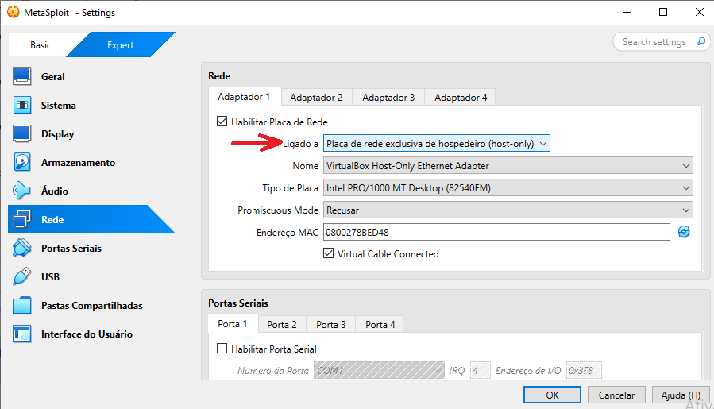
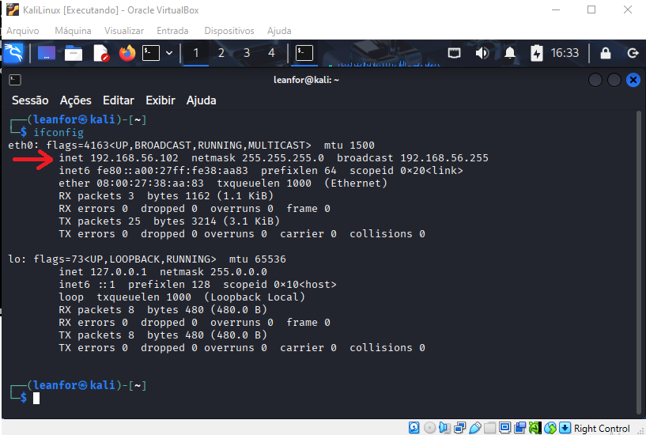
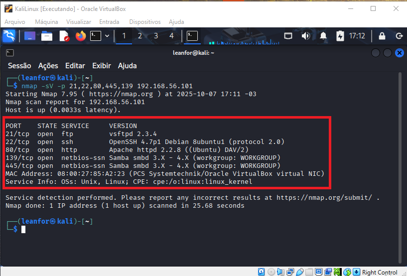
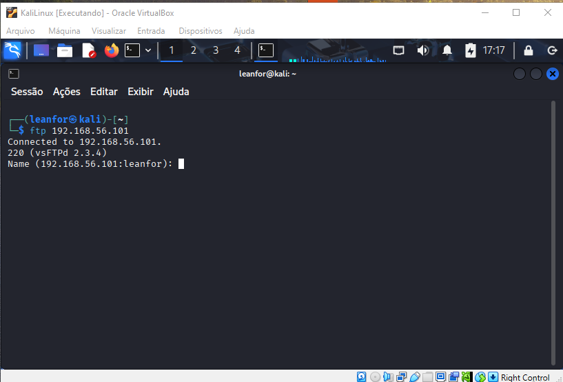
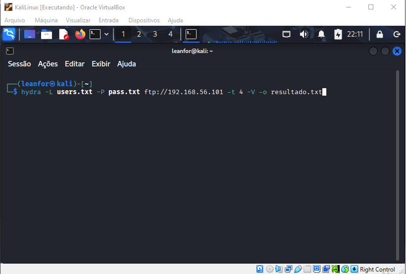
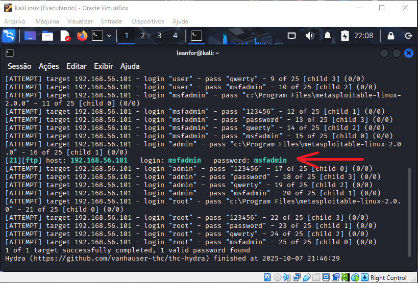
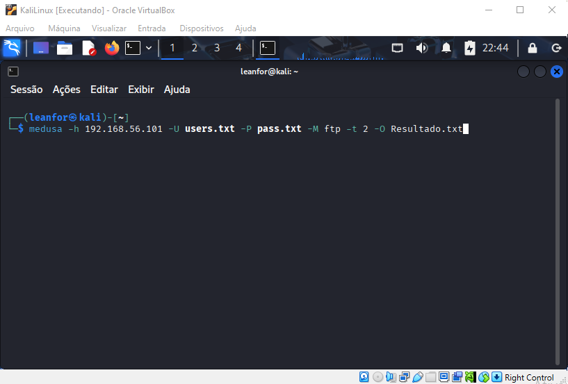
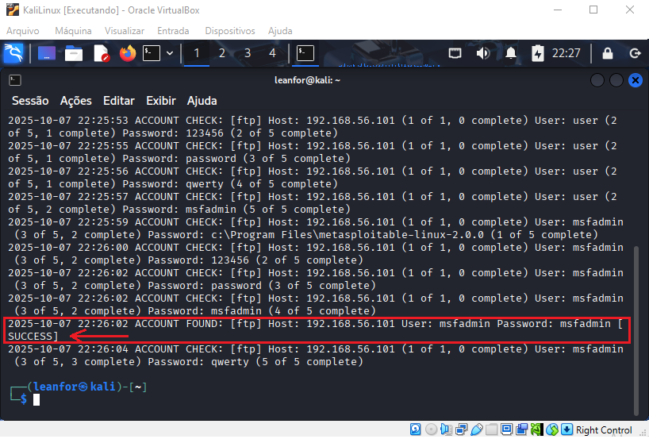

<div align="center">
  
# 🛡️ Desafio DIO: Simulação de Ataque de Força Bruta


</div>

---

## 📋 Sumário
* [🎯 Descrição do Projeto](#-descrição-do-projeto)
* [🛠️ Tecnologias e Ferramentas](#%EF%B8%8F-tecnologias-e-ferramentas)
* [⚙️ Configuração do Ambiente](#%EF%B8%8F-detalhes-da-instalação-e-versões)
* [🚀 Enumeração de Serviços (Reconhecimento Ativo)](#-enumeração-de-serviços-reconhecimento-ativo)
* [📋 Criação das Wordlists (Lista de Tentativas)]()
* [💥 1. Ataque de Força Bruta em Serviço FTP com Hydra]()
* [💥 2. Ataque de Força Bruta em Serviço FTP com Medusa]()
* [💡 Medidas de Mitigação](#medidas-de-mitigação)
* [🔗 Como Contribuir / Contato](#como-contribuir--contato)

---

## 🎯 Descrição do Projeto

Este repositório documenta a execução do **Desafio de Projeto da DIO** focado em segurança cibernética. O objetivo foi simular, em um ambiente controlado, cenários de ataque de **Força Bruta** (Brute Force Attack) em diferentes serviços, utilizando ferramentas do Kali Linux para exercitar a compreensão de vulnerabilidades e propor medidas de prevenção eficazes.

> ⚠️ **Disclaimer:** Este projeto foi realizado estritamente em um ambiente de laboratório isolado, utilizando máquinas virtuais propositalmente vulneráveis (Metasploitable 2 e DVWA), com o único propósito de aprendizado e auditoria de segurança.

## 🛠️ Tecnologias e Ferramentas

| Ferramenta | Uso no Projeto |
| :---: | :---: |
| <br/> | Gerenciamento da rede Host-Only e das VMs.
| <br/> | Sistema operacional do atacante.
| <br/> | Alvo vulnerável (FTP, SMB).
| <br/> | Ataques paralelos, como Password Spraying em SMB.
| <br/> | Ataques de login em diversos protocolos (FTP, Web).
| <br/> | Alvo para testes de formulários Web.

## ⚙️ Detalhes da Instalação e Versões

Embora muitas das ferramentas (Hydra, Medusa, Nmap) já venham pré-instaladas e configuradas no Kali Linux, é importante listar o comando de instalação (caso necessário) e a versão utilizada.

Observação: Todos os comandos de instalação abaixo foram executados no terminal do Kali Linux.

| Ferramenta | Link | Versão Utilizada
| :---: | :---: | :---: |
| VirtualBox	| https://download.virtualbox.org/virtualbox/7.2.2/VirtualBox-7.2.2-170484-Win.exe |	7.2.2
| Kali Linux	| https://elmirror.cl/kali-images/kali-2025.3/kali-linux-2025.3-installer-amd64.iso | Kali Linux 2025.3
| Metasploitable 2	| https://sourceforge.net/projects/metasploitable/files/latest/download |	2.0.0
| Hydra	| sudo apt install hydra (Se não estiver instalado)	hydra -V | 9.5
| Medusa	| sudo apt install medusa (Se não estiver instalado)	medusa -V | 2.3
| Nmap | sudo apt install nmap (Se não estiver instalado) nmap -V | 7.95

## ⚙️ Configuração do Ambiente

A configuração de rede entre as duas Máquinas Virtuais (VMs) é o ponto mais crucial. Optamos pela rede **Host-Only** (Rede Interna/Somente Host) para garantir que o ambiente de ataque estivesse completamente isolado da sua rede doméstica e da Internet. Veremos isso mais abaixo no item `Configuração das Máquinas Virtuais (VMs)`.

### 1. Instalação do VirtualBox, kali Linux, Metasploitable e Preparação da Rede Host-Only para as imagens

1. **Instalação do VirtualBox -** A instalação é bem simples, no meu caso, segui com as opções padrões até a finalização.
2. **Download Kali Linux e Metasploitable -** Faça o download dos 2 programas e jogue num diretório a sua escolha.

**🛠️--- Kali Linux ---** </br>

3. **Instalação Kali Linux -** Com o VirtualBox aberto, clique no botão New(novo), escolha um nome para a imagem e selecione o arquivo ISO apontando para o diretório onde foi feito o download. Observe a imagem abaixo.

<div align="right">
  <details>
    <summary font-weight: bold;">
      [Configuração Kali Linux]
    </summary>
    
  </details>
</div>

4. **Inicio da intalação -** Vai parar na tela "Kali Linux Installer menu (BIOS mode)", escolha a opção `Graphical install`.
5. **Tela "Linguagem" -** Escolha `Portuguese` e clique em continuar, nas telas seguintes escolha os itens referente ao Brasil.
6. **Tela "Configurar a Rede" -** Mantenha o nome sugerido, no caso Kali.
7. **Tela "Nome do domínio" -** Não digite nada e clique em continuar.
8. **Tela "Conta do usuário" -**  Crie um para ser utilizado sempre que for entrar no Kali Linux.
9. **Tela "Configurar usuários e senhas" -** Crie uma senha para o usuário que criou.
10. **Tela "Configurar o relógio" -** Escolha `Distrito Federal`.
11. **Tela "Particionar discos" -** Escolha `Assistido - Usar o disco inteiro`. Na tela seguinte mantenha `Todos os arquivos em uma partição`, e continue. Na tela seguinte, mantenha `Finalizar o particionamento e escrever as mudanças no disco` e continue. Na última dela deste processo, selecione `sim` e continue.
12. **Tela "Seleção de softwares" -** Mantenha como esta e continue.
13. **Tela "Instalar o carregador de inicialização GRUB" -** Mantenha sim e continue. Na tela seguinte, escolha o seu HD, deve ser algo do tipo `/dev/sda(xxxxxx)`, e continue.
14. **Rodando a imagem -** Agora vc pode carregar a imagem para ela finalizar a instalação, a tela final pedira Login e senha.

**🛠️--- Metasploitable ---** </br>

15. **Descompactação do Metasploitable -** O Metasploitable não é uma ISO, mas sim um arquivo `.VMDK`. O download vai diponibilizar um arquivo zip que deverá ser descompactado.
16. **Instalação do Metasploitable -** Com o VirtualBox aberto, clique no botão New(novo), escolha um nome para a imagem, NÃO selecione NENHUM arquivo ISO. Escolha o `Linux` como o sistema operacional e finalize.  Observe a imagem abaixo.

<div align="right">
  <details>
    <summary font-weight: bold;">
      [Instalação do Metasploitable]
    </summary>
    
  </details>
</div>

17. **Configuração do Metasploitable -** Com o VirtualBox aberto, selecione a imagem do Metasploitable criada e clique em `Configurações`.
18. **Sistema -** Selecione a aba Sistema, no item `Placa-Mãe` vamos manter apenas o boot pelo `Disco Rígido`. Observe a imagem abaixo.

<div align="right">
  <details>
    <summary font-weight: bold;">
      [Sistema]
    </summary>
    
  </details>
</div>

19. **Armazenamento Passo 1-** Neste item, primeiro vamos remover o `MetaSploit_.vdi`. Observe a imagem abaixo.

<div align="right">
  <details>
    <summary font-weight: bold;">
      [Armazenamento Passo 1]
    </summary>
    
  </details>
</div>

20. **Armazenamento Passo 2-** Agora vamos adicionar um novo disco rígido. Clique no botão `Add hard disc`. Observe a imagem abaixo.

<div align="right">
  <details>
    <summary font-weight: bold;">
      [Armazenamento Passo 2]
    </summary>
    
  </details>
</div>

21. **Armazenamento Passo 3-** Agora vamos adicionar o arquivo `.VMDK`. Clique no botão `Acrescentar`, depois selecione o arquivo `.VMDK` e clique em abrir. Observe a imagem abaixo.

<div align="right">
  <details>
    <summary font-weight: bold;">
      [Armazenamento Passo 3]
    </summary>
    
  </details>
</div>

22. **Armazenamento Passo 4-** Por último, selecione o arquivo carregado e clique em Escolher.  Observe a imagem abaixo.

<div align="right">
  <details>
    <summary font-weight: bold;">
      [Armazenamento Passo 4]
    </summary>
    
  </details>
</div>

23. **Rodando a imagem -** Agora vc pode carregar a imagem para ela finalizar a instalação, a tela final pedira Login e senha.  `Login: msfadmin` | `Senha: msfadmin` .

### 2. Configuração das Máquinas Virtuais (VMs)

Para ambas as VMs (Kali Linux e Metasploitable 2):

1.  **Configurações -** Selecione a VM e vá em `Configurações` (Settings).
2.  **Rede -** Selecione a seção `Rede` (Network).
3.  **Adaptador 1 -** Mude o campo `Conectado a:` para **"Rede Somente Host"** (`Host-only Adapter`). Observe a imagem abaixo.

<div align="right">
  <details>
    <summary font-weight: bold;">
      [Adaptador 1]
    </summary>
    
  </details>
</div>

4.  **Inicialização:** Inicie ambas as VMs.

### 3. Validação dos Endereços IP

Após iniciar as VMs, é necessário verificar ou definir seus IPs manualmente para garantir a comunicação:

#### A) Kali Linux (Atacante)
* **Comando:** Abra o terminal e execute: `ip addr show` ou `ifconfig`
* **Verificação:** Procure o IP associado ao adaptador `eth1` ou `enp0s8` (o nome do adaptador Host-Only).
* **IP Esperado:** Deve ser algo como `192.168.56.X` (Ex: `192.168.56.102`). Observe a imagem abaixo.

<div align="right">
  <details>
    <summary font-weight: bold;">
      [Verificação Kali]
    </summary>
    
  </details>
</div>


#### B) Metasploitable 2 (Alvo)
* **Comando:** Faça login e execute: `ifconfig`
* **Verificação:** Verifique o IP.
* **IP Esperado:** Deve ser algo como `192.168.56.Y` (Ex: `192.168.56.101`). Observe a imagem abaixo.

<div align="right">
  <details>
    <summary font-weight: bold;">
      [Verificação Meta]
    </summary>
    
  </details>
</div>

### 4. Teste de Conectividade
* Do Kali, teste a comunicação com o Metasploitable:</br></br>
  ```bash
  ping c3 192.168.56.102 
  ```
* **Resultado Esperado:** 3 pacotes de resposta (`64 bytes from...`). Se o ping funcionar, seu ambiente está pronto para os ataques!

## 🚀 Enumeração de Serviços (Reconhecimento Ativo)
Antes de lançar o ataque de força bruta, o primeiro passo é confirmar quais serviços estão ativos no alvo. Neste cenário, faremos uma varredura para identificar o serviço FTP (Porta 21) no Metasploitable 2.

**Objetivo**</br></br>
Identificar se o serviço **FTP (Porta 21)** está aberto e pronto para receber conexões, além de confirmar outros serviços comuns.

1.1. **Varredura de Portas e Versões (Nmap)**</br></br>
Usaremos o Nmap para realizar uma varredura de portas específica e obter informações detalhadas sobre a versão do serviço (`-sV`).

**Comando de Execução:**</br></br>
No terminal do Kali Linux, digite o seguinte comando, substituindo `[IP_DO_METASPLOITABLE]` pelo endereço real da sua VM alvo:</br></br>
  ```bash
  nmap -sV -p 21,22,80,445,139 [IP_DO_METASPLOITABLE]
  ```
| Parâmetro | Função |
| :--- | :--- |
| `-sV` | Tenta determinar a versão do serviço rodando nas portas. |
| `-p` | Limita a varredura a portas específicas (21=FTP, 22=SSH, 80=HTTP, 445/139=SMB). |

Resultado Esperado:</br></br>
O Nmap deverá confirmar o status da Porta 21 como `open` e exibir a versão do serviço (ex: `vsftpd 2.3.4`), confirmando que o alvo está pronto. Observe a imagem abaixo.

<div align="right">
  <details>
    <summary font-weight: bold;">
      [Resultado Esperado]
    </summary>
    
  </details>
</div>

1.2. **Validação Manual do Serviço FTP**</br></br>
Para validar a descoberta antes de usar o Hydra ou Medusa, confirmamos a conexão manualmente usando o cliente FTP:

Comando de Conexão:

No terminal, tente se conectar:</br></br>
```bash
ftp [IP_DO_METASPLOITABLE]
```

Status:

A solicitação imediata de credenciais (`Name:`) confirma que o serviço FTP está aberto, acessível e é um alvo válido para o ataque de força bruta. Observe a imagem abaixo.

<div align="right">
  <details>
    <summary font-weight: bold;">
      [Serviço FTP aberto]
    </summary>
    
  </details>
</div>

## 📋 Criação das Wordlists (Lista de Tentativas)
Antes de executar o ataque com Hydra ou Medusa, é necessário criar e popular os arquivos de texto (`wordlists`) que a ferramenta usará para testar usuários e senhas.

**Opção 1:** Criação Rápida Via Comando `echo` (Terminal)</br></br>
Este método é rápido e ideal para criar listas curtas diretamente no terminal.

**A. Wordlist de Usuários (`users.txt`)**</br>
Usamos `>` (criar/sobrescrever) na primeira linha e `>>` (adicionar ao final) nas linhas seguintes:</br></br>

```bash
echo "msfadmin" > wordlists/users.txt
echo "root" >> wordlists/users.txt
echo "user" >> wordlists/users.txt
```

**B. Wordlist de Senhas (`pass.txt`)**</br></br>
```bash
echo "msfadmin" > wordlists/pass.txt
echo "password" >> wordlists/pass.txt
echo "123456" >> wordlists/pass.txt
```
</br>

**Opção 2:** Criação Manual Via Editor de Texto (`mousepad`)</br></br>
Este método é ideal para criar `wordlists` mais longas ou que exigem organização visual, usando um editor de texto gráfico do Kali Linux.

**A. Criando a Wordlist de Usuários (`users.txt`)**</br>
1. **Abra e Crie o Arquivo:** No terminal do Kali, execute o comando abaixo. Ele usará o `mousepad` para criar e abrir o arquivo `users.txt` no diretório wordlists/.
```bash
mousepad wordlists/users.txt &
```
Nota: O símbolo `&` no final permite que o editor abra em uma janela separada enquanto você mantém o terminal ativo.

2. **Popule o Arquivo:** No `mousepad`, digite os usuários que você deseja testar. Cada usuário deve ocupar uma linha.

Conteúdo Exemplo de `users.txt`:
```bash
msfadmin
root
user
```
Crie o Arquivo: No terminal, use o comando para criar e abrir o arquivo diretamente no editor `mousepad`:
```bash
mousepad wordlists/pass.txt &
```
Nota: O símbolo `&` no final permite que o editor abra em uma janela separada enquanto você mantém o terminal ativo.

Popule o Arquivo: No `mousepad`, digite as senhas (uma senha por linha) e salve.

Conteúdo Exemplo de `pass.txt`:
```bash
msfadmin
password
123456
```
3. **Salve e Feche:** Salve o arquivo e feche o editor mousepad.

**B. Criando a Wordlist de Senhas (`pass.txt`)**</br>
1. **Abra e Crie o Arquivo:** Repita o processo, desta vez para o arquivo de senhas:
```bash
mousepad wordlists/pass.txt &
```
2. **Popule o Arquivo:** Na nova janela do `mousepad`, digite as senhas que você deseja testar. Cada senha deve ocupar uma linha.

Conteúdo Exemplo de `pass.txt`:
```bash
msfadmin
password
123456
```
3. **Salve e Feche:** Salve o arquivo e feche o editor.

Com esses dois arquivos criados e preenchidos no diretório correto, você garante que o comando Hydra ou Medusa terá todas as entradas necessárias para a simulação do ataque.

## 💥 1. Ataque de Força Bruta em Serviço FTP com Hydra
Continuando a partir do serviço que identificamos como aberto (Porta 21), agora simularemos um ataque de força bruta usando a ferramenta Hydra para descobrir as credenciais de login. Observe a imagem abaixo.

<div align="right">
  <details>
    <summary font-weight: bold;">
      [Descobrir credencial]
    </summary>
    
  </details>
</div>

**1.1. Aplicando Teste de Força Bruta - FTP**
| Detalhe | Valor |
| :--- | :--- |
| **Alvo** | Metasploitable 2 (Serviço FTP - Porta 21) |
| **Ferramenta** | Hydra |
| **Wordlist** | wordlists/users.txt |
| **Wordlist** | wordlists/pass.txt |

1.2. **Comando Utilizado**
Utilizamos o Hydra fornecendo uma lista de usuários e uma lista de senhas, indicando o protocolo (`ftp`) e o endereço do alvo.
```bash
hydra -L wordlists/users_ftp.txt -P wordlists/ftp_passwords.txt ftp://[IP_DO_METASPLOITABLE] -t 4 -V -o Resultado.txt
```
🔬 **Detalhamento do Comando Hydra**
|Elemento do Comando | Função | Explicação |
| :---: | :---:| :---:|
| `hydra` | Ferramenta | Chama o programa Hydra (Hídra), o principal cracker de logins de rede. |
| `-L wordlists/users_ftp.txt` | Lista de Usuários | Define o caminho (`-L` de List) para o arquivo que contém a lista de nomes de usuário a serem testados (um por linha). |
| `-P wordlists/ftp_passwords.txt` | Lista de Senhas | Define o caminho (`-P` de Password List) para o arquivo que contém a lista de senhas a serem testadas (uma por linha). |
| `ftp://[IP_DO_METASPLOITABLE]` | Alvo e Serviço | Especifica o protocolo (`ftp`) e o endereço IP do servidor alvo (o Metasploitable). |
| `-t 4` | Tarefas/Threads | Define o número de tarefas ou conexões simultâneas (`threads`) que o Hydra tentará abrir contra o alvo. O valor `4` significa que ele tentará 4 logins ao mesmo tempo, aumentando a velocidade. |
| `-V` | Modo Verbose | Coloca o Hydra em modo detalhado (`Verbose`), o que faz com que ele exiba na tela cada tentativa de login (usuário e senha) que está sendo testada. |
| `-o Resultado.txt` | Saída para Arquivo | Direciona a saída completa (`-o` de Output), incluindo logs e credenciais encontradas, para um arquivo chamado `Resultado.txt`. Isso é útil para análise posterior. |

🎯 **Objetivo do Comando**</br></br>
Em resumo, o comando instrui o Hydra a:</br>

1. Carregar a lista de usuários e a lista de senhas.</br>
2. Tentar combinações dessas listas contra o serviço FTP no alvo especificado.</br>
3. Fazer isso rapidamente, usando 4 conexões simultâneas.</br>
4. Mostrar todos os testes na tela (`-V`) e salvar o resultado final no arquivo `Resultado.txt`.</br>

1.3. **Validação de Acesso e Credenciais**
Credenciais Descobertas: Após a execução, o Hydra encontrou com sucesso a credencial: `[USUÁRIO_ENCONTRADO]`/`[SENHA_ENCONTRADA]`. Observe a imagem abaixo.

<div align="right">
  <details>
    <summary font-weight: bold;">
      [Credencial descoberta]
    </summary>
    
  </details>
</div>

Comprovação: Neste passo utilizaremos o comando `ftp://[IP_DO_METASPLOITABLE]`, e vamos inserir a credencial encontrada. O acesso foi validado usando o comando `ftp` seguido do login bem-sucedido. Observe a imagem abaixo.

<div align="right">
  <details>
    <summary font-weight: bold;">
      [Acesso FTP]
    </summary>
    
  </details>
</div>

💥 **2. Ataque de Força Bruta em Serviço FTP com Medusa** </br></br>
Neste cenário, demonstramos o uso da ferramenta Medusa para realizar um ataque rápido e eficaz contra o serviço FTP do Metasploitable 2.

**Objetivo**</br>
Descobrir as credenciais de login do FTP (`porta 21`) usando `wordlists` de usuários e senhas.

2.1. **Preparação das Wordlists (`Já criadas no ataque usando Hydra`)**</br>
Arquivo de Usuários (users.txt): Deve conter os usuários a serem testados (ex: msfadmin, user, root).</br>
Arquivo de Senhas (pass.txt): Deve conter as senhas a serem testadas (ex: msfadmin, password, 123456).

2.2. **Execução do Ataque com Medusa**</br>
O Medusa é eficiente para ataques paralelos e pode ser usado de forma semelhante ao Hydra. Usaremos os parâmetros para definir o alvo, as listas e o protocolo.

**Comando de Execução:**
No terminal do Kali Linux, digite o seguinte comando:
```bash
medusa -h 192.168.56.102 -U wordlists/users.txt -P wordlists/pass.txt -M ftp -t 2 -O Resultado.txt
```
🔬 **Detalhamento do Comando Medusa**
|Elemento do Comando | Função | Explicação |
| :---: | :---:| :---:|
| `medusa` | Ferramenta | Chama o programa Medusa, projetado para realizar ataques de força bruta rápidos e paralelos contra diversos serviços de rede. |
| `-h 192.168.56.102` | Host Alvo | Define o endereço IP (`-h` de host) do servidor que você está tentando acessar (o Metasploitable 2, neste caso). |
| `-U wordlists/users.txt` | Lista de Senhas | Define o caminho (`-P` de Passwordlist) para o arquivo que contém a lista de senhas a serem testadas, uma por linha. |
| `-P wordlists/pass.txt` | Lista de Senhas | Define o caminho (`-P` de Password List) para o arquivo que contém a lista de senhas a serem testadas (uma por linha). |
| `-M ftp` | Módulo/Serviço | Especifica o módulo (`-M` de Module) ou protocolo que será atacado. Aqui, é o FTP (File Transfer Protocol), que é o serviço de transferência de arquivos. |
| `-t 2` | Tarefas/Threads | Define o número de conexões simultâneas (`threads`) que o Medusa usará. O valor 2 indica que ele tentará 2 logins ao mesmo tempo, aumentando a velocidade do ataque sem sobrecarregar o alvo. |
| `-o Resultado.txt` | Saída para Arquivo | Direciona a saída completa (`-o` de Output), incluindo logs e credenciais encontradas, para um arquivo chamado `Resultado.txt`. Isso é útil para análise posterior. |

🎯 **Objetivo do Comando**</br></br>
O comando instrui o Medusa a usar as listas de usuários e senhas para tentar forçar o acesso ao serviço FTP rodando no IP 192.168.56.102, fazendo isso com 2 tentativas paralelas, e salvando o log de todas as ações no arquivo `Resultado.txt`. Observe a imagem abaixo.

<div align="right">
  <details>
    <summary font-weight: bold;">
      [Descobrir credencial]
    </summary>
    
  </details>
</div>

2.3. **Análise do Resultado**</br>
Após a conclusão do ataque, é possível visualizar no no terminal o resultado do comando. Observe a imagem abaixo.

<div align="right">
  <details>
    <summary font-weight: bold;">
      [Credencial descoberta]
    </summary>
    
  </details>
</div>

O Medusa salva o log no arquivo Resultado.txt. Para visualizar a credencial descoberta, você pode usar um editor de texto ou um leitor de terminal:</br></br>
**Comando para Visualizar o Log:**
```bash
cat Resultado.txt 
# OU
less Resultado.txt
```
**Resultado Esperado:**
A linha final do log confirmará o sucesso do ataque, exibindo a combinação correta (ex: msfadmin:msfadmin), confirmando o sucesso da simulação.

