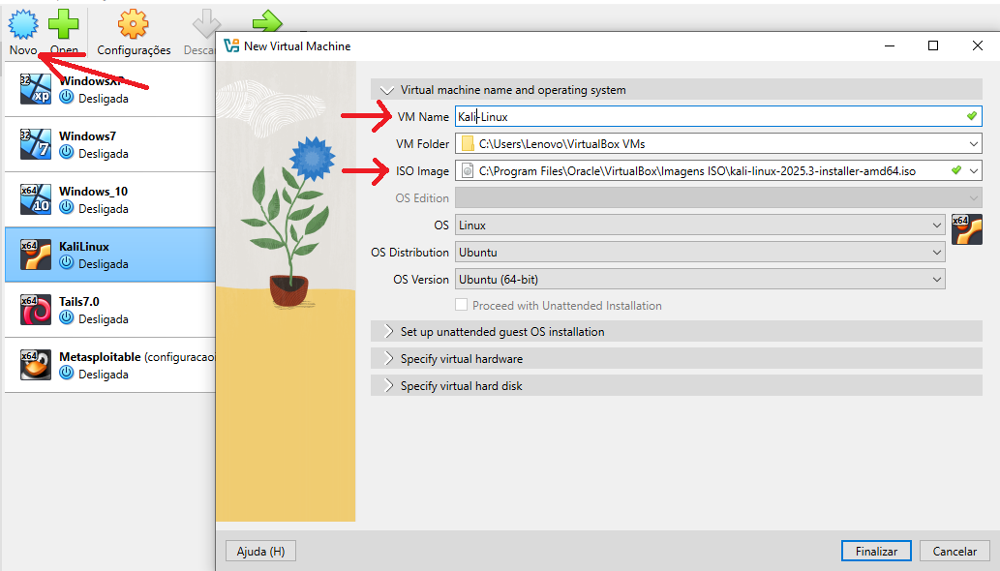
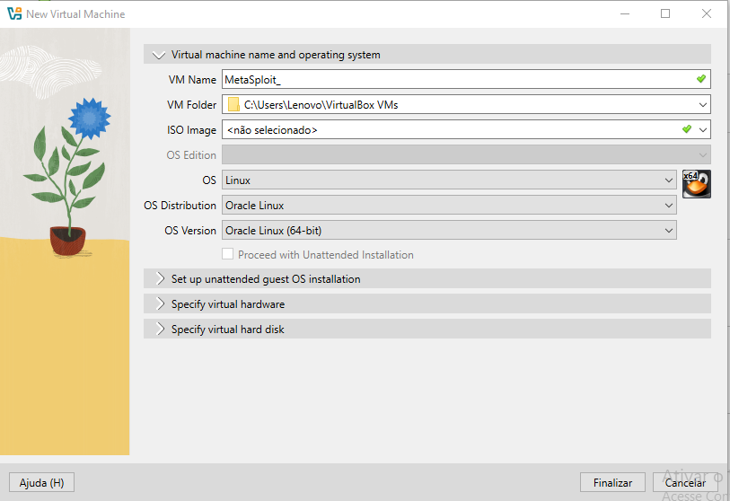
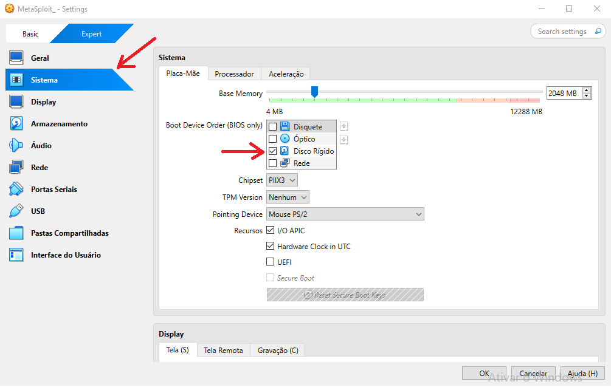
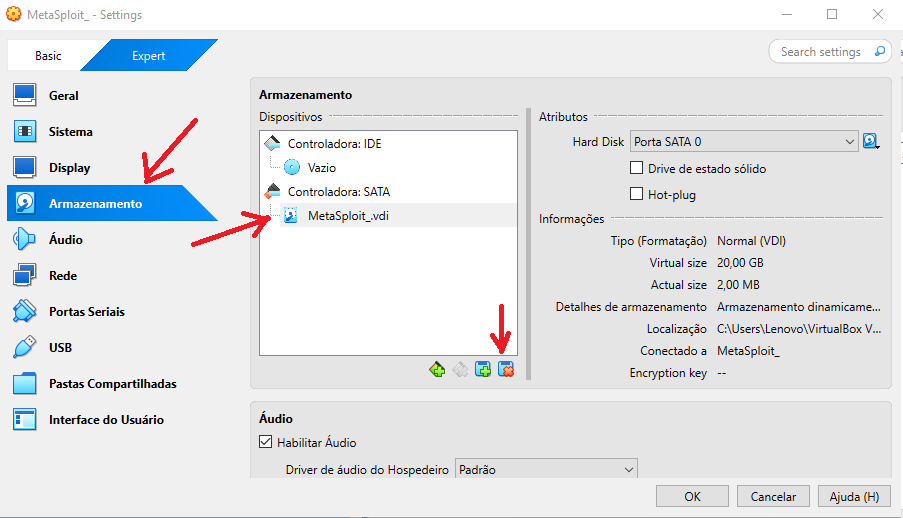
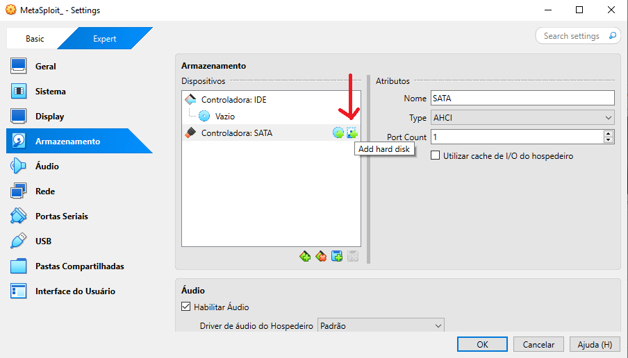
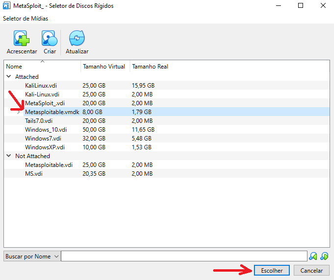

<div align="center">
  
# 🛡️ Desafio DIO: Simulação de Ataque de Força Bruta


</div>

---

## 📋 Sumário
* [🎯 Descrição do Projeto](#-descrição-do-projeto)
* [🛠️ Tecnologias e Ferramentas](#%EF%B8%8F-tecnologias-e-ferramentas)
* [⚙️ Configuração do Ambiente](#-configuracao-do-ambiente)
* [🚀 Cenários de Ataque Documentados](#-cenários-de-ataque-documentados)
* [💡 Medidas de Mitigação](#-medidas-de-mitigação)
* [🔗 Como Contribuir / Contato](#-como-contribuir--contato)

---

## 🎯 Descrição do Projeto

Este repositório documenta a execução do **Desafio de Projeto da DIO** focado em segurança cibernética. O objetivo foi simular, em um ambiente controlado, cenários de ataque de **Força Bruta** (Brute Force Attack) em diferentes serviços, utilizando ferramentas do Kali Linux para exercitar a compreensão de vulnerabilidades e propor medidas de prevenção eficazes.

> ⚠️ **Disclaimer:** Este projeto foi realizado estritamente em um ambiente de laboratório isolado, utilizando máquinas virtuais propositalmente vulneráveis (Metasploitable 2 e DVWA), com o único propósito de aprendizado e auditoria de segurança.

## 🛠️ Tecnologias e Ferramentas

| Ferramenta | Uso no Projeto |
| :---: | :---: |
| <br/> | Gerenciamento da rede Host-Only e das VMs.
| <br/> | Sistema operacional do atacante.
| <br/> | Alvo vulnerável (FTP, SMB).
| <br/> | Ataques paralelos, como Password Spraying em SMB.
| <br/> | Ataques de login em diversos protocolos (FTP, Web).
| <br/> | Alvo para testes de formulários Web.

## ⚙️ Detalhes da Instalação e Versões

Embora muitas das ferramentas (Hydra, Medusa, Nmap) já venham pré-instaladas e configuradas no Kali Linux, é importante listar o comando de instalação (caso necessário) e a versão utilizada.

Observação: Todos os comandos de instalação abaixo foram executados no terminal do Kali Linux.

| Ferramenta | Link | Versão Utilizada
| :---: | :---: | :---: |
| VirtualBox	| https://download.virtualbox.org/virtualbox/7.2.2/VirtualBox-7.2.2-170484-Win.exe |	7.2.2
| Kali Linux	| https://elmirror.cl/kali-images/kali-2025.3/kali-linux-2025.3-installer-amd64.iso | Kali Linux 2025.3
| Metasploitable 2	| https://sourceforge.net/projects/metasploitable/files/latest/download |	2.0.0
| Hydra	| sudo apt install hydra (Se não estiver instalado)	hydra -V | 9.5
| Medusa	| sudo apt install medusa (Se não estiver instalado)	medusa -V | 2.3
| Nmap | sudo apt install nmap (Se não estiver instalado) nmap -V | 7.95

## ⚙️ Configuração do Ambiente

A configuração de rede entre as duas Máquinas Virtuais (VMs) é o ponto mais crucial. Optamos pela rede **Host-Only** (Rede Interna/Somente Host) para garantir que o ambiente de ataque estivesse completamente isolado da sua rede doméstica e da Internet.

### 1. Instalação do VirtualBox, kali Linux, Metasploitable e Preparação da Rede Host-Only para as imagens

1. **Instalação do VirtualBox -** A instalação é bem simples, no meu caso, segui com as opções padrões até a finalização.
2. **Download Kali Linux e Metasploitable -** Faça o download dos 2 programas e jogue num diretório a sua escolha.

**🛠️--- Kali Linux ---** </br>

3. **Instalação Kali Linux -** Com o VirtualBox aberto, clique no botão New(novo), escolha um nome para a imagem e selecione o arquivo ISO apontando para o diretório onde foi feito o download. Observe a imagem abaixo.

<div align="right">
  <details>
    <summary font-weight: bold;">
      [Configuração Kali Linux]
    </summary>
    
  </details>
</div>

4. **Inicio da intalação -** Vai parar na tela "Kali Linux Installer menu (BIOS mode)", escolha a opção `Graphical install`.
5. **Tela "Linguagem" -** Escolha `Portuguese` e clique em continuar, nas telas seguintes escolha os itens referente ao Brasil.
6. **Tela "Configurar a Rede" -** Mantenha o nome sugerido, no caso Kali.
7. **Tela "Nome do domínio" -** Não digite nada e clique em continuar.
8. **Tela "Conta do usuário" -**  Crie um para ser utilizado sempre que for entrar no Kali Linux.
9. **Tela "Configurar usuários e senhas" -** Crie uma senha para o usuário que criou.
10. **Tela "Configurar o relógio" -** Escolha `Distrito Federal`.
11. **Tela "Particionar discos" -** Escolha `Assistido - Usar o disco inteiro`. Na tela seguinte mantenha `Todos os arquivos em uma partição`, e continue. Na tela seguinte, mantenha `Finalizar o particionamento e escrever as mudanças no disco` e continue. Na última dela deste processo, selecione `sim` e continue.
12. **Tela "Seleção de softwares" -** Mantenha como esta e continue.
13. **Tela "Instalar o carregador de inicialização GRUB" -** Mantenha sim e continue. Na tela seguinte, escolha o seu HD, deve ser algo do tipo `/dev/sda(xxxxxx)`, e continue.
14. **Rodando a imagem -** Agora vc pode carregar a imagem para ela finalizar a instalação, a tela final pedira Login e senha.

**🛠️--- Metasploitable ---** </br>

15. **Descompactação do Metasploitable -** O Metasploitable não é uma ISO, mas sim um arquivo `.VMDK`. O download vai diponibilizar um arquivo zip que deverá ser descompactado.
16. **Instalação do Metasploitable -** Com o VirtualBox aberto, clique no botão New(novo), escolha um nome para a imagem, NÃO selecione NENHUM arquivo ISO. Escolha o `Linux` como o sistema operacional e finalize.  Observe a imagem abaixo.

<div align="right">
  <details>
    <summary font-weight: bold;">
      [Instalação do Metasploitable]
    </summary>
    
  </details>
</div>

17. **Configuração do Metasploitable -** Com o VirtualBox aberto, selecione a imagem do Metasploitable criada e clique em `Configurações`.
18. **Sistema -** Selecione a aba Sistema, no item `Placa-Mãe` vamos manter apenas o boot pelo `Disco Rígido`. Observe a imagem abaixo.

<div align="right">
  <details>
    <summary font-weight: bold;">
      [Sistema]
    </summary>
    
  </details>
</div>

19. **Armazenamento Passo 1-** Neste item, primeiro vamos remover o `MetaSploit_.vdi`. Observe a imagem abaixo.

<div align="right">
  <details>
    <summary font-weight: bold;">
      [Armazenamento Passo 1]
    </summary>
    
  </details>
</div>

20. **Armazenamento Passo 2-** Agora vamos adicionar um novo disco rígido. Clique no botão `Add hard disc`. Observe a imagem abaixo.

<div align="right">
  <details>
    <summary font-weight: bold;">
      [Armazenamento Passo 2]
    </summary>
    
  </details>
</div>

21. **Armazenamento Passo 3-** Agora vamos adicionar o arquivo `.VMDK`. Clique no botão `Acrescentar`, depois selecione o arquivo `.VMDK` e clique em abrir. Observe a imagem abaixo.

<div align="right">
  <details>
    <summary font-weight: bold;">
      [Armazenamento Passo 3]
    </summary>
    
  </details>
</div>

22. **Armazenamento Passo 4-** Por último, selecione o arquivo carregado e clique em Escolher.  Observe a imagem abaixo.

<div align="right">
  <details>
    <summary font-weight: bold;">
      [Armazenamento Passo 4]
    </summary>
    
  </details>
</div>

23. **Rodando a imagem -** Agora vc pode carregar a imagem para ela finalizar a instalação, a tela final pedira Login e senha.  `Login: msfadmin` | `Senha: msfadmin` .

### 2. Configuração das Máquinas Virtuais (VMs)

Para ambas as VMs (Kali Linux e Metasploitable 2):

1.  **Configurações:** Clique na VM e vá em `Configurações` (Settings).
2.  **Rede:** Selecione a seção `Rede` (Network).
3.  **Adaptador 1:** Mude o campo `Conectado a:` para **"Rede Somente Host"** (`Host-only Adapter`).
4.  **Nome:** Selecione a rede Host-Only que você criou no passo 1 (Ex: `vboxnet0`).
5.  **Inicialização:** Inicie ambas as VMs.

### 3. Validação dos Endereços IP

Após iniciar as VMs, é necessário verificar ou definir seus IPs manualmente para garantir a comunicação:

#### A) Kali Linux (Atacante)
* **Comando:** Abra o terminal e execute: `ip addr show` ou `ifconfig`
* **Verificação:** Procure o IP associado ao adaptador `eth1` ou `enp0s8` (o nome do adaptador Host-Only).
* **IP Esperado:** Deve ser algo como `192.168.56.X` (Ex: `192.168.56.101`).

#### B) Metasploitable 2 (Alvo)
* **Comando:** Faça login e execute: `ifconfig`
* **Verificação:** Verifique o IP.
* **IP Esperado:** Deve ser algo como `192.168.56.Y` (Ex: `192.168.56.102`).

### 4. Teste de Conectividade
* Do Kali, teste a comunicação com o Metasploitable:
    ```bash
    ping 192.168.56.102 
    ```
* **Resultado Esperado:** Pacotes de resposta (`64 bytes from...`). Se o ping funcionar, seu ambiente está pronto para os ataques!

## 🚀 Cenários de Ataque Documentados

Aqui detalhamos a execução dos ataques e os comandos utilizados. As evidências (screenshots e GIFs) estão disponíveis na pasta `images/`.

### 1. Força Bruta em Serviço FTP

| Detalhe | Valor |
| :--- | :--- |
| **Alvo** | Metasploitable 2 (Serviço FTP - Porta 21) |
| **Ferramenta** | **Hydra** |
| **Wordlist** | `wordlists/ftp_passwords.txt` |

<div align="center">
    
    <p><i>(Substituir pela sua GIF ou screenshot)</i></p>
</div>

**Comando Utilizado:**

```bash
# Exemplo de comando que utilizou um usuário (-l) e uma lista de senhas (-P)
hydra -l msfadmin -P wordlists/pass_simples.txt ftp://[IP_METASPLOITABLE] -V
